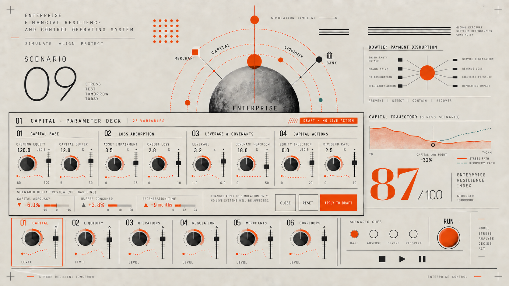
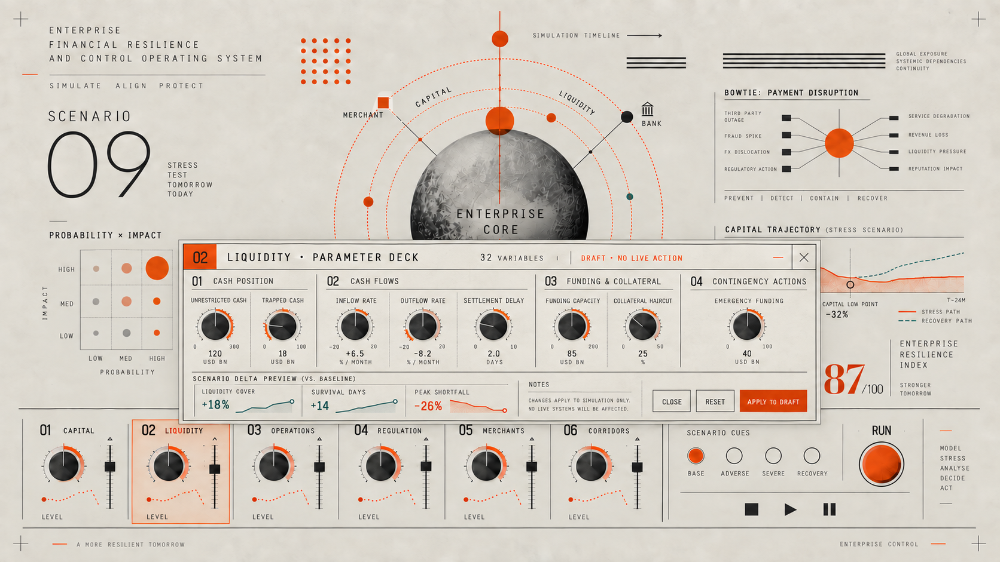
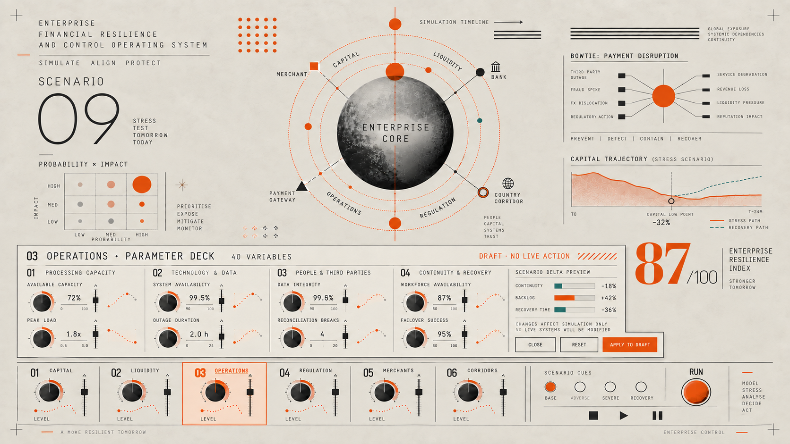
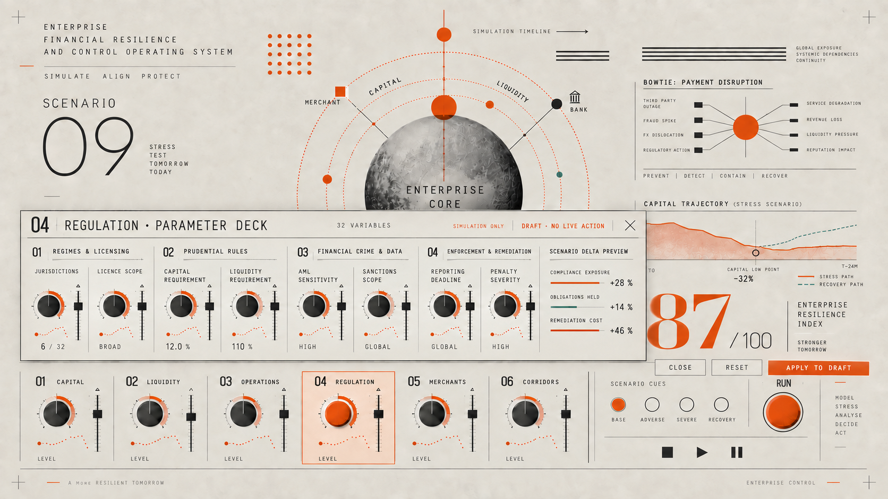
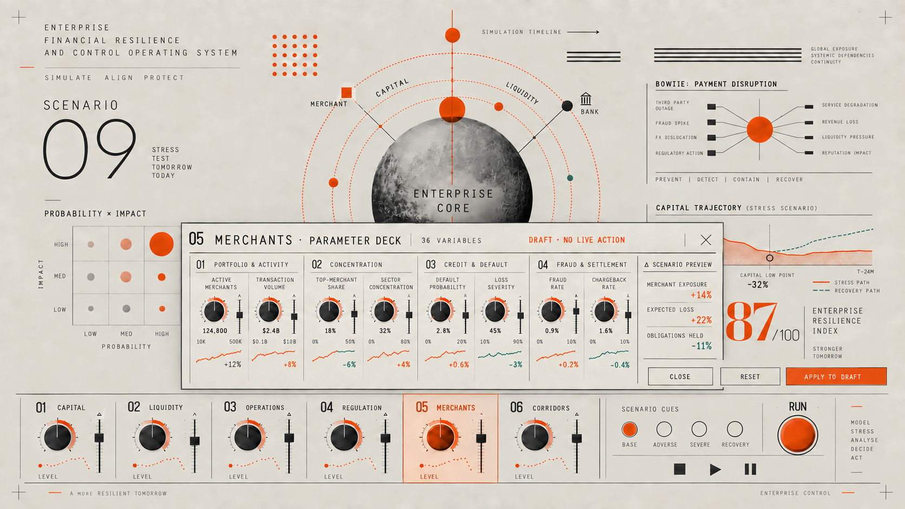
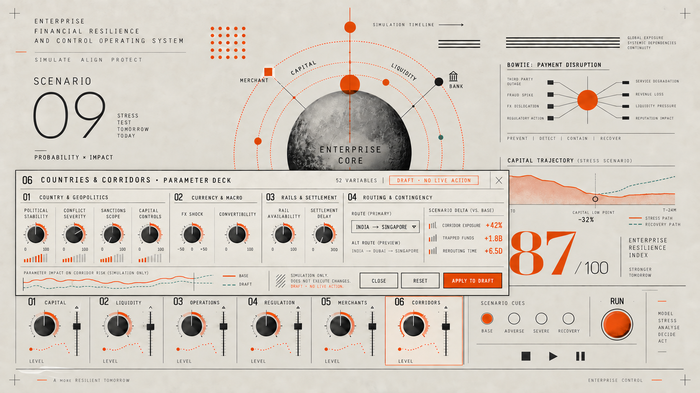

# M22 Control Popup UX/UI Design

**Production foundation:** `m22-console-editorial-concept-v1.4-core-heatmap`

**Purpose:** Provide direct manipulation of the 220 simulation variables through six channel-specific parameter decks.

The concept images below were composed on V1.2 and remain valid for popup layout and interaction. The production implementation uses the V1.4 inner-enterprise, external-environment and core-heat-map model beneath the same decks.

## Interaction model

Selecting any bottom console channel opens a wide parameter deck anchored immediately above that channel. The selected channel receives an orange outline and active dial treatment. The enterprise core, current scenario, major risk views and Enterprise Resilience Index remain visible so the operator retains context while changing inputs.

Each deck contains:

1. channel number, title and total variable count;
2. four logical variable groups;
3. representative high-priority dials and faders;
4. current value, unit, permitted range and automation trace;
5. a scenario-delta preview showing expected downstream effects;
6. `DRAFT · NO LIVE ACTION` boundary status;
7. `CLOSE`, `RESET` and `APPLY TO DRAFT` actions.

The concept artwork shows the priority variables for each control. The working interface will expose every variable from the [Manipulated Variable Register](M22_MANIPULATED_VARIABLE_REGISTER.md) through group expansion, search, filters and an advanced-parameters view.

## Shared behaviour

- Opening a deck never runs a simulation.
- Every parameter deck is draggable by its title bar so the user can reposition it without losing sight of relevant dashboard information.
- Dragging is constrained to the dashboard workspace; the title bar, close control and draft-status indicator must always remain reachable.
- A deck can snap to the top, bottom, left, right or its originating console channel, and `RESET POSITION` returns it to the default anchored location.
- The interface remembers each user's preferred deck position and restores it when that control is opened again.
- Keyboard users can move the deck in defined increments and return it to its default position; pointer and touch dragging receive equivalent behaviour.
- Moving a deck changes presentation only and never changes a model parameter, scenario value or simulation result.
- Parameter changes remain local to a scenario draft.
- `APPLY TO DRAFT` validates the changes, records evidence and updates the preview.
- `RUN` executes the complete draft through the simulation engine.
- Changed parameters display their baseline, proposed value and delta.
- Dependent controls display calculated effects without silently rewriting the original input.
- Invalid ranges, incompatible combinations and missing evidence are identified before application.
- Keyboard focus moves into the opened deck and returns to its channel when closed.
- Escape closes the deck only when there are no unapplied changes; otherwise it opens a discard-changes decision.

## Draggable-window requirement

The title area is the dedicated drag handle. Interactive controls inside the deck never initiate a drag. While moving, the deck uses a lightweight outline preview and displays available snap zones. On release, it settles into the selected position without covering the active channel unless the user placed it there deliberately.

The production implementation must support:

- mouse, trackpad, touch and keyboard movement;
- viewport boundaries and collision handling;
- zoom and responsive-layout changes;
- position persistence by user and control;
- `RESET POSITION` and `RESET ALL POSITIONS` commands;
- visible focus, descriptive accessible labels and announced position changes;
- reduced-motion preferences;
- deterministic screen position in exported evidence and screenshots.

## Six parameter decks

### 01 Capital — 28 variables

Groups: Capital Base; Loss Absorption; Leverage & Covenants; Capital Actions.  
Preview: capital adequacy, buffer consumed and regeneration time.

### 02 Liquidity — 32 variables

Groups: Cash Position; Cash Flows; Funding & Collateral; Contingency Actions.  
Preview: liquidity cover, survival days and peak shortfall.

### 03 Operations — 40 variables

Groups: Processing Capacity; Technology & Data; People & Third Parties; Continuity & Recovery.  
Preview: operational continuity, backlog and recovery time.

### 04 Regulation — 32 variables

Groups: Regimes & Licensing; Prudential Rules; Financial Crime & Data; Enforcement & Remediation.  
Preview: compliance exposure, obligations held and remediation cost.

### 05 Merchants — 36 variables

Groups: Portfolio & Activity; Concentration; Credit & Default; Fraud & Settlement.  
Preview: merchant exposure, expected loss and obligations held.

### 06 Countries & Corridors — 52 variables

Groups: Country & Geopolitics; Currency & Macro; Rails & Settlement; Routing & Contingency.  
Preview: corridor exposure, trapped funds and rerouting time.

## Visual system

- Warm ivory paper field and subtle physical texture
- Graphite black structure and instrumentation
- Burnt orange for selection, stress, changed values and primary actions
- Restrained teal for recovery or favourable movement
- Square panels, thin rules and technical numbering
- Narrow uppercase labels paired with large editorial numerals
- Mechanical dials, faders and automation traces rather than generic form controls
- No decorative depth that weakens the scientific-instrument character

## Implementation boundary

These parameter decks manipulate simulation state only. They cannot initiate payments, modify source ledgers, change live controls or execute operational interventions. Every applied draft retains the user, time, baseline, changed values, evidence references and scenario version.
