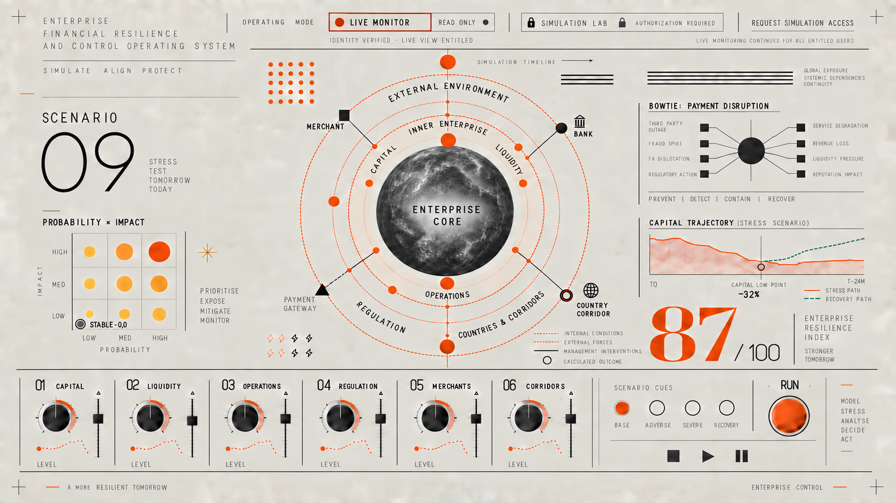
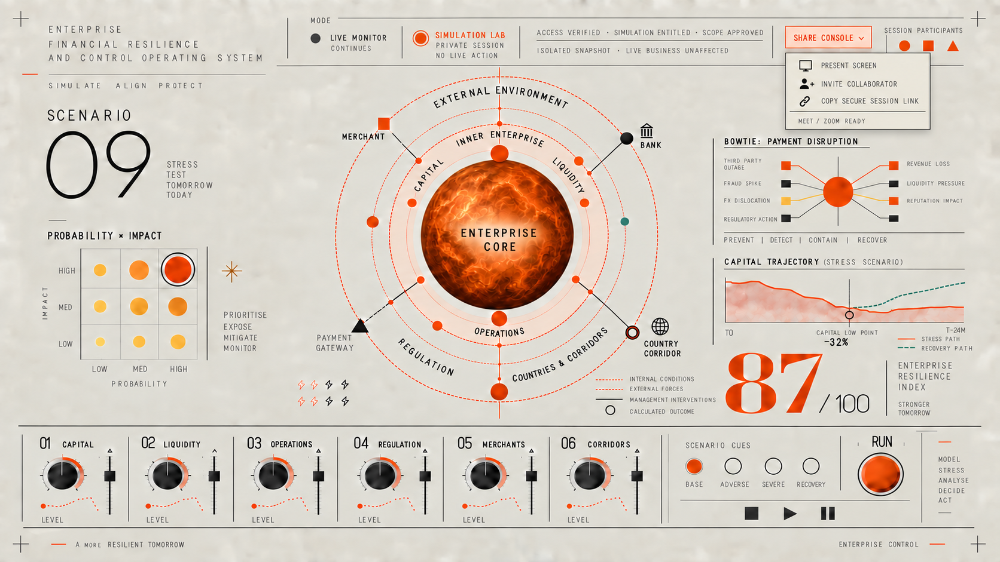

# M22 Operating Modes, Authorization and Collaboration

## 1. Two operating modes

### Live Monitor

Live Monitor is the default view for entitled dashboard users. It presents the current approved enterprise state and continuously updates as source feeds permit.

- Read-only observation
- Current state, alerts, explanations and recommended remedies
- No manipulation of live values
- No direct execution of financial or operational actions
- Continues running for all entitled users while simulations are active

### Simulation Lab

Simulation Lab is an isolated per-user or shared-session workspace created from an immutable, timestamped baseline.

- Manipulation of approved simulation variables
- What-if shocks, interventions, recovery actions and comparisons
- No writes to live systems
- No interruption or mode change for other dashboard users
- Persistent `SIMULATION LAB · NO LIVE ACTION` indication

## 2. Mode switching

The mode control changes only the requesting user's workspace. It never changes the enterprise-wide operating state.

When a user selects Simulation Lab, the system:

1. verifies identity and active session;
2. checks the user's simulation entitlement;
3. checks enterprise, entity, jurisdiction and data-scope permissions;
4. performs step-up authentication when policy requires it;
5. records the authorization decision;
6. creates an isolated simulation session from a timestamped baseline;
7. displays the baseline time, data scope, owner and session status;
8. leaves Live Monitor running independently.

If authorization fails, the mode does not change. The interface explains the denied entitlement or scope and records the attempt without revealing restricted data.

Returning to Live Monitor closes the simulation view only for that user. The user must save, archive or discard an uncommitted draft before exit.

## 3. Required authorization controls

- Enterprise single sign-on
- Role-based and attribute-based access control
- Simulation entitlement separate from live-view entitlement
- Entity, country, corridor and data-classification scope
- Step-up multi-factor authentication where required
- Session expiration and idle timeout
- Device and network policy checks where required
- Segregation-of-duties restrictions
- Immediate entitlement revocation
- Complete authorization and activity audit trail

Recommended permissions include:

- `live:view`
- `simulation:create`
- `simulation:edit`
- `simulation:share`
- `simulation:approve`
- `simulation:export`
- `evidence:view`

## 4. Simulation isolation

Every simulation receives a unique session and branch identifier. Its baseline is immutable. Parameter changes, calculated states, comments and evidence remain inside that branch.

Simulation events use a separate write path and storage namespace from live monitoring. No simulation API is allowed to call a live financial-action endpoint. A preferred remedy can be converted into a remediation proposal, but implementation requires a separate approved operating workflow.

## 5. Collaboration model

The simulation owner can share the private console with specifically selected participants. Each participant must authenticate to the application and pass entitlement and data-scope checks.

Available roles:

| Role | Capability |
|---|---|
| Presenter | Shares the owner's view without application control |
| Viewer | Observes the simulation and evidence |
| Co-analyst | Changes permitted variables and creates branches |
| Approver | Reviews and approves a simulation or proposed remedy |
| Auditor | Reviews the immutable activity and evidence record |

The owner can set role, data scope, expiry, download permission and whether a participant may invite others. Access can be revoked immediately.

## 6. Sharing options

### Present screen

The owner can share the console visually through an approved Google Meet or Zoom meeting. This transmits the displayed screen but does not grant application access or control.

### Invite collaborator

The system sends or copies a secure application-session invitation. The recipient must authenticate and receive the assigned role before seeing any simulation data.

### Secure session link

A scoped, expiring link can direct an invited participant to the session. The link is not sufficient by itself; identity, entitlement and scope checks still apply.

Google Meet or Zoom provides audio, video and screen presentation. It must not be treated as an identity provider or access-control mechanism for the risk console. A meeting invitation never grants console access.

## 7. Concurrent collaboration

- Participant presence is visible using names or approved identifiers.
- Every parameter change identifies its author and time.
- A parameter can be temporarily locked while one analyst edits it.
- Conflicting changes create separate branches or require an explicit resolution.
- Comments and decisions attach to the relevant parameter, risk, time step or evidence item.
- The owner can pause editing, remove participants or return the session to private mode.
- The run record preserves participants, roles, changes, branches, approvals and exports.

## 8. Persistent mode indicators

Live Monitor displays:

- `LIVE MONITOR · READ ONLY`
- identity and live-view entitlement status
- live-data timestamp and feed status
- locked Simulation Lab state when the user lacks access

Simulation Lab displays:

- `SIMULATION LAB · PRIVATE SESSION · NO LIVE ACTION`
- authorization and scope status
- baseline snapshot timestamp
- session owner and participant count
- sharing state
- a visible route back to Live Monitor
- confirmation that live monitoring continues unaffected

The mode indication remains visible while parameter decks, dialogs or collaboration menus are open.

## 9. Concept artwork

